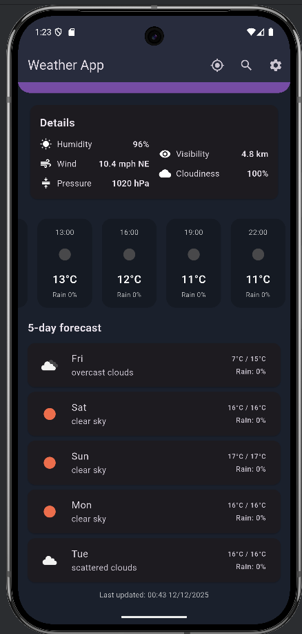
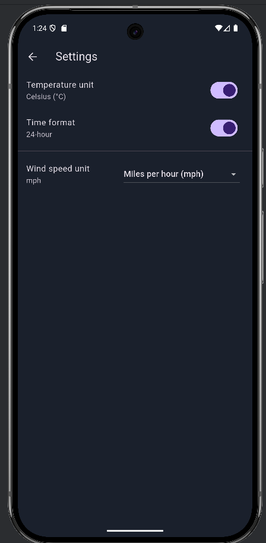

# Weather App (Flutter + OpenWeatherMap)

Ứng dụng Flutter hiển thị thời tiết hiện tại và dự báo theo giờ/ngày, sử dụng API từ OpenWeatherMap.  
Dự án được xây dựng cho môn *Phát triển ứng dụng đa nền tảng*.

---

## 🚀 Tính năng chính

- Xem **thời tiết hiện tại** theo:
  - Thành phố nhập vào
  - Vị trí GPS của người dùng
- Hiển thị thông tin:
  - Nhiệt độ, cảm nhận, độ ẩm, mây, áp suất
  - Tốc độ & hướng gió
  - Mặt trời mọc & lặn
- **Dự báo theo giờ** (Hourly forecast)
- **Dự báo theo ngày** (Daily forecast)
- **Tìm kiếm thành phố**, lưu lịch sử recent search
- **Settings**:
  - Đơn vị nhiệt độ (°C / °F)
  - Định dạng giờ (12h / 24h)
  - Đơn vị tốc độ gió (m/s, km/h, mph)
- **Cache offline** bằng SharedPreferences
- Xử lý lỗi rõ ràng:
  - Lỗi mạng
  - Sai tên thành phố
  - Quá hạn mức API

---

## 📁 Cấu trúc thư mục (lib)
```sh
lib/
    main.dart
    config/
    models/
    providers/
    screens/
    services/
    utils/
    widgets/
```
---
## ⚙️ Yêu cầu môi trường

- Flutter SDK 3.x+
- Dart SDK 3.x
- Android Studio hoặc VS Code
- Tài khoản OpenWeatherMap để lấy API key

---

## 🔑 API Setup

1. Get free API key from OpenWeatherMap  
2. Copy `.env.example` to `.env`  
3. Add your API key to `.env`  

Ví dụ file `.env`:
OPENWEATHER_API_KEY=your_api_key_here

Khi chạy app, truyền API key vào Flutter:
flutter run --dart-define=OPENWEATHER_API_KEY=your_api_key_here

---

## ▶️ Cài đặt & chạy ứng dụng

### 1. Cài dependencies

flutter pub get

### 2. Thiết lập API key

Tạo `.env` rồi thêm API key của bạn.

### 3. Chạy ứng dụng

flutter run --dart-define=OPENWEATHER_API_KEY=your_api_key_here

---

## 📱 Hướng dẫn sử dụng

### Home Screen
- Hiển thị thời tiết hiện tại
- Danh sách dự báo theo giờ
- Danh sách dự báo theo ngày
- Nhấn icon GPS để lấy vị trí hiện tại
- Nhấn icon Search để tìm theo thành phố
- Nhấn Settings để đổi đơn vị


### Search Screen
- Nhập tên thành phố → xem thời tiết
- Lưu lịch sử recent search
- Nhấn vào chip để tìm lại nhanh


### Forecast Screen
- Hiển thị danh sách forecast chi tiết theo giờ/ngày



### Settings Screen
- Chọn đơn vị nhiệt độ
- Đổi định dạng thời gian
- Chọn đơn vị tốc độ gió
- Lưu lại bằng SharedPreferences



---

## 🧩 Mô tả kỹ thuật

- **State management**: Provider  
- **Services**:
  - WeatherService (call API)
  - LocationService (geolocator + geocoding)
  - StorageService (cache local + recent searches)
- **Models**: Weather, Forecast  
- **UI**: Material Design, load icon bằng cached_network_image  
- **Date formatting**: intl package  

---

## 📝 Ghi chú

- Dự án tuân theo kiến trúc tách lớp: UI → Provider → Service → Model  
- Có sử dụng SharedPreferences, Provider, API HTTP, Geolocator, Geocoding  
- Xử lý lỗi rõ ràng và có cache offline  
- Hỗ trợ nhiều đơn vị đo lường & cài đặt  

## 📄 License
Dùng cho mục đích học tập và nộp bài môn học.